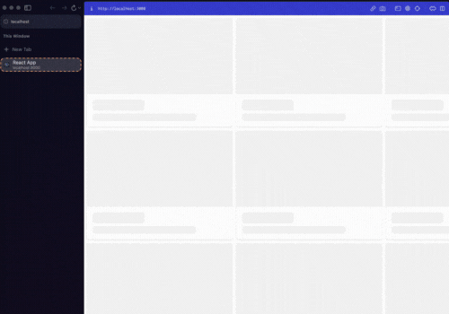
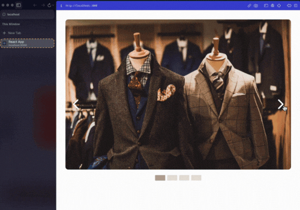
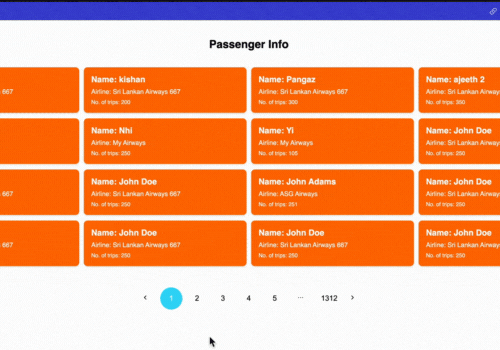

# :zap: Fundamental UI Components :zap:

This repository showcases a basic and useful UI built using TypeScript, styled-components, and React, without relying on any UI libraries. It includes various UI components that can enhance the user experience of your web application.

## Version

🔖 <strong>v1.0.0</strong> - Current Version

## Features

:carousel_horse: Carousel: A customizable carousel component that allows you to showcase images or content in a slideshow format. It supports autoplay, navigation controls, and custom styling options.

:milky_way: Modal: An interactive modal component that provides a modal overlay to display additional information or capture user input. It includes options for customization, such as modal size and animation effects.

:page_with_curl: Pagination: A pagination component that enables easy navigation through a set of data or pages. It offers flexible customization options, including the number of items per page and the total number of pages.

:foggy: Skeleton: A skeleton loading component that gives users a visual representation of content while it is being loaded. It helps improve the perceived performance and usability of your application.

:arrow_double_down: Scroll-based Infinite Scroll: An infinite scroll component that loads additional content as the user scrolls down the page. It provides a seamless and dynamic browsing experience by fetching and displaying data incrementally.

## Directory Structure

Each UI component is organized within its respective directory and contains relevant information and code pertaining to that component. Here is an overview of the directories and their contents:

- [Skeleton](/skeleton-ui/): Contains the code and documentation for the Skeleton component.
- [Carousel](/carousel/): Contains the code and documentation for the Carousel component.
- [Modal](/modal/): Contains the code and documentation for the Modal component.
- [Pagination](/pagination/): Contains the code and documentation for the Pagination component.
- [Infinite Scroll-v1](/infinite-scroll-v1/): Contains the code and documentation for the Scroll-based Infinite Scroll component.

## Purpose

I built this repository not only to gain a deep understanding of the ins and outs of each UI component but also to provide a valuable resource for other developers. By creating these components from scratch without relying on UI libraries, I have honed my skills and knowledge in TypeScript, styled-components, and React. This project serves as a learning opportunity for others who want to understand the inner workings of these UI elements and develop a strong foundation in building custom UI components.

## Demo

Feel free to explore the directories and utilize these UI components to enhance the visual appeal and functionality of your web application without depending on UI libraries.

Please refer to the individual component directories for detailed usage instructions, code samples, and customization options.
