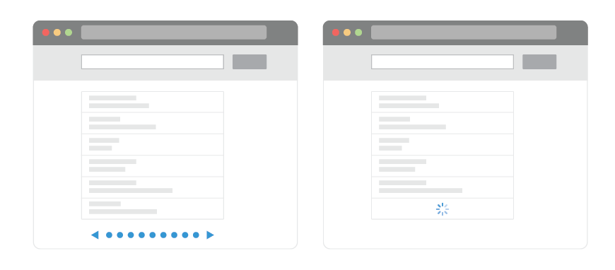
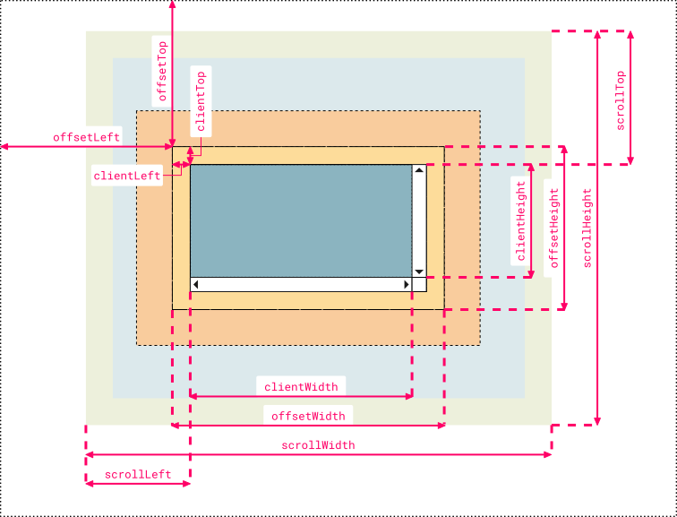

# Infinite Scroll - Scroll-Based Approach



## What Is Infinite Scroll?

When you need to fetch a large amount of data through an API and render it on the screen, one way to optimize performance is by implementing pagination.

Using pagination on mobile devices can be <strong>inconvenient because it requires manually pressing individual number buttons to navigate to the desired page.</strong> In such cases, an alternative approach is to implement infinite scrolling.

## How Infinite Scroll Works?

Infinite scrolling allows users to <strong>continuously load the next set of items without any separate interaction</strong>, as they scroll through the content. As the user scrolls and reaches the end of the preloaded content, the next list is loaded, ensuring a seamless and convenient experience.

## Factors to Determine for Infinite Scroll



```javascript
Element.scrollHeight;
```

- It represents the total height of an element, including any content that overflows and is not visible outside.

```javascript
Element.clientHeight;
```

- The inner height of an element (<strong>excluding</strong> padding, excluding scroll bar height, margin, and border).

```javascript
Element.offsetHeight;
```

- The inner height of an element (<strong>including</strong> padding, excluding scroll bar height, margin, and border).

```javascript
Element.scrollTop;
```

- The position at which the top part of the scroll bar has come into view on the screen.
<blockquote>
When (scrollHeight - clientHeight - scrollTop) < a pre-defined offset, it can be determined that the scroll has reached the bottom. At this point, you can fetch the data in the next page and append it to the existing items.
</blockquote>

## Limitations to Scroll-Based Approach

- Performance Impact
  - Since an event is triggered every time the scroll moves, it can potentially cause performance issues. To address this, <i>throttling</i> is commonly applied to scroll events to limit the frequency of the events being triggered.
- Accesbility
- Loss of Navigation Control
- Content Organization
- Difficulty in Reaching the Footer
