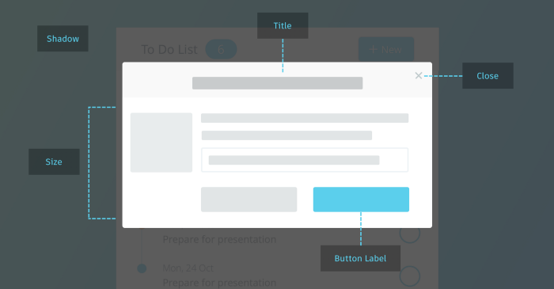

# Modals



## How Do Modals Work?

Modal is a method of displaying components on top of a basic window.

<blockquote>
The window beneath the modal is in an <strong>inactive state (dimmed)</strong>, preventing the user from interacting with the content and interface outside the active modal window.
</blockquote>
<blockquote>
This technique is commonly used to attract the user's attention or focus.
</blockquote>

## Things to Know to Understand Modals

- Window:
  This refers to the underlying window on which the modal is displayed. The basic window is positioned beneath the modal.
  <br/>
- Component:
  Components are the elements or widgets that are displayed within the modal. They can include buttons, forms, images, or any other interactive elements.
  <br/>
- Displaying method:
  Modals are typically displayed using techniques such as overlays or pop-ups. They appear on top of the base window, creating a layered effect.
  <br/>
- Dimmed state:
  The window beneath the modal is usually dimmed or darkened to indicate that it is inactive. This prevents the user from interacting with the content or interface outside the modal.
  <br/>
- User interaction:
  While the modal is active, the user's attention and focus are directed towards it. The user cannot interact with the content or interface outside the modal until they close or dismiss it.

## Things We Need for Modals

&#9632; Portal
Portals provide a way to render elements into an external DOM.

```javascript
ReactDOM.createPortal(child, container);
```

The first argument (`child`) can be any React child element, such as an element, string, or fragment, that you want to render.

The second argument (`container`) is a DOM element where you want to render the portal content. It specifies the target container in the external DOM where the portal will be rendered. The content rendered within the portal will be appeared

### Example Using React + TS

```javascript
import React from "react";
import { createPortal } from "react-dom";

interface Props {
  selector?: string;
}

const Portal: React.FC<Props> = ({ children, selector }) => {
  const rootElement = selector && document.querySelector(selector);

  return <>{rootElement ? createPortal(children, rootElement) : children}</>;
};

export default Portal;
```

In the example above, the Portal component doesn't return a new element but instead renders the child elements under the rootElement. The rootElement can be placed anywhere inside the DOM, depending on how it is declared, and it doesn't matter where it is located within the DOM.

&#9632; react-transition-group
[react-transition-group](https://reactcommunity.org/react-transition-group/) is a library for easily adding transitions to React components. It allows you to apply appropriate transitions when components appear, enter, or exit, providing smoother screen transition effects when turning a modal on and off.
