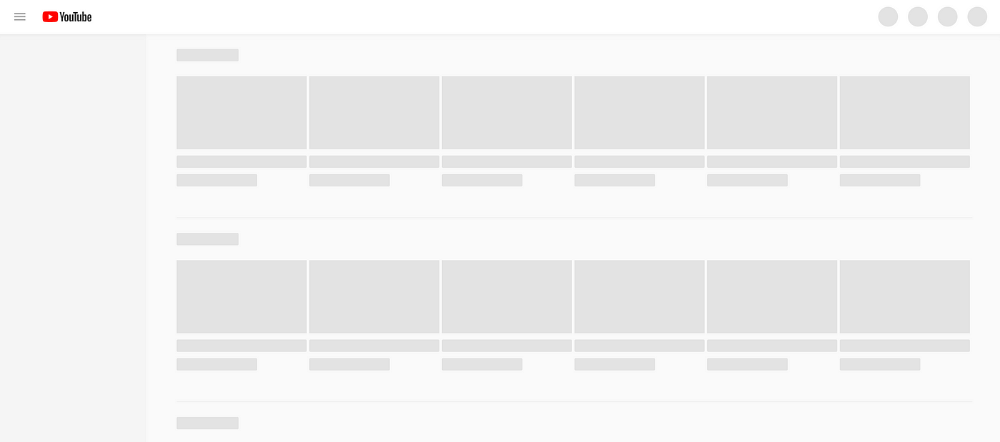

# Skeleton

## Pros & Cons of Skeleton Component

<table>
    <tr>
        <th>Pros</th>
        <th>Cons</th>
    </tr>
    <tr>
        <td>
            Users percceive skeleton components to be faster than spinners and blank pages when content is loading.
        </td>
        <td>It is true that displaying skeleton components on each screen can be relatively time-consuming and costly.
        </td>
    </tr>
</table>

## Skeleton Rules for a Better UX

- Skeleton should not impede the loading of content.
- <strong>When designing a skeleton, it is good to use animation.</strong> Animation, such as wave, pulse, or fading wave, can create a perception of shorter loading time.
- Using slow and steady animations can create a perception of shorter loading time.
